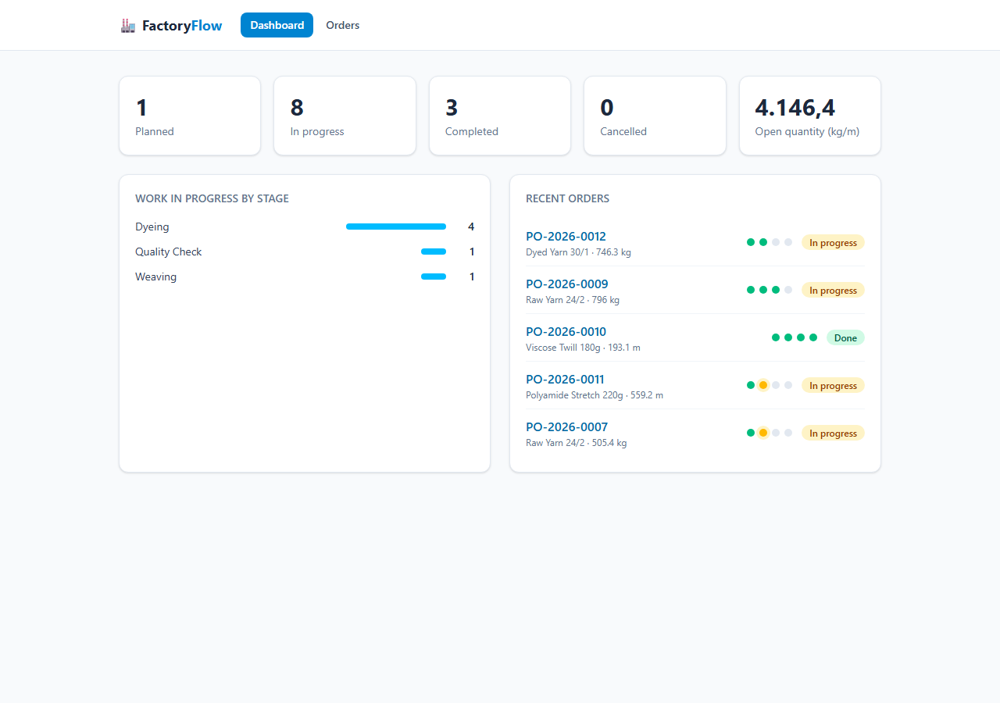

# 🏭 Factory Flow

A lean **production-order tracker for textile plants** — the kind of system I've been building
for industrial clients for 10 years, distilled into a small, readable codebase.

Production orders move through a configurable routing (Weaving → Dyeing → Finishing → Quality
Check). The dashboard shows what's sitting on the factory floor right now, per stage.

[](https://github.com/danbws/factory-flow/actions/workflows/ci.yml)



## Why this project

Real factories don't lose money in code — they lose it between stages: a batch waiting two days
for the dyehouse, an order nobody started. Factory Flow models the smallest set of concepts that
makes that visible:

- **Product** — what gets manufactured (fabric, yarn)
- **Production Order** — a quantity of a product, for a customer, with a due date
- **Routing** — the ordered stages the batch walks through, with start/finish timestamps

One endpoint — `POST /orders/{id}/advance` — drives the whole lifecycle: it starts the current
stage or finishes it and starts the next, completing the order at the end. State transitions are
guarded (no advancing finished orders, no cancelling completed ones) and covered by tests.

## Stack

| Layer    | Tech                                              |
|----------|---------------------------------------------------|
| Backend  | Python 3.12 · FastAPI · SQLAlchemy 2.0 · Pydantic |
| Database | PostgreSQL 16 (SQLite in-memory for tests)        |
| Frontend | React 18 · TypeScript · Vite · Tailwind CSS 4     |
| Infra    | Docker Compose                                    |

## Run it

```bash
docker compose up --build
```

Then seed demo data and open the app:

```bash
docker compose exec backend python -m app.seed
```

- Frontend: http://localhost:5173
- API docs (Swagger): http://localhost:8000/docs

### Local development (without Docker)

```bash
# Backend — needs a local PostgreSQL, or set DATABASE_URL
cd backend
pip install -r requirements.txt
uvicorn app.main:app --reload

# Frontend
cd frontend
npm install
npm run dev
```

### Tests

```bash
cd backend
pytest
```

## API at a glance

| Method | Path                      | Purpose                                  |
|--------|---------------------------|------------------------------------------|
| GET    | `/api/dashboard`          | KPIs, WIP per stage, recent orders       |
| GET    | `/api/products`           | List products                            |
| POST   | `/api/products`           | Create product (unique SKU)              |
| GET    | `/api/orders`             | List orders (filter by `status`)         |
| POST   | `/api/orders`             | Create order with default/custom routing |
| POST   | `/api/orders/{id}/advance`| Start/finish stages, complete the order  |
| POST   | `/api/orders/{id}/cancel` | Cancel (unless already completed)        |

## About me

I'm Daniel Bichof — full-stack developer with 10 years building ERP systems for textile and
chemical manufacturers in Brazil. The production system this project is inspired by issues
20,000+ electronic invoices a year and tracks 250,000+ dyeing batches.

[LinkedIn](https://www.linkedin.com/in/danbichof) · daniel@websys.ind.br

## License

MIT
